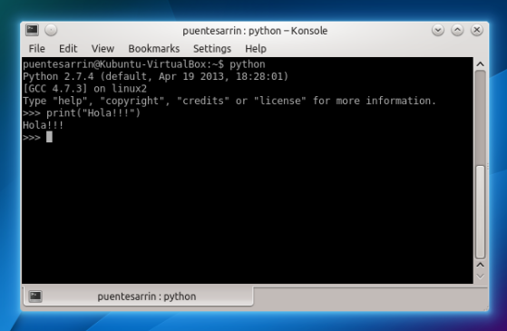
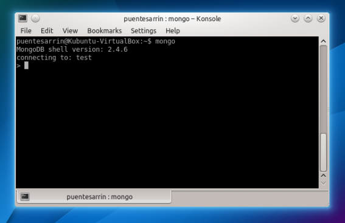

.. Python y MongoDB para desarrolladores slides file, created by
   hieroglyph-quickstart on Fri Oct 25 10:21:13 2013.

===============
¿Qué es Python?
===============

.. image:: _static/python-logo.png

Es un lenguaje de programación interpretado cuya filosofía hace hincapié en una
sintaxis muy limpia y que favorezca un código legible.

Creado por Guido van Rossum en el año 1991.

Intérprete Python
=================

Es un programa que ejecuta código Python desde un archivo o de manera
interactiva.

Variables y tipos
=================

.. code-block:: pycon

   >>> a = "Hola"
   >>> type(a)
   <type 'str'>
   >>> b = 123
   >>> type(b)
   <type 'int'>
   >>> a = True
   >>> type(a)
   <type 'bool'>
   >>> def imprime(cadena):
   ...     print(cadena)
   ...
   >>> type(imprime)
   <type 'function'>
   >>> d = imprime
   >>> d("Jorge")
   Jorge

Más variables y tipos
=====================

.. code-block:: pycon

   >>> a = [1, 2, 3, 4, 4, 1]
   >>> print(a)
   [1, 2, 3, 4, 4, 1]
   >>> type(a)
   <type 'list'>
   >>> b = tuple([1, 2, 3, 4, 4, 1])
   >>> type(b)
   <type 'tuple'>
   >>> c = set([1, 2, 3, 4, 4, 1])
   >>> type(c)
   <type 'set'>
   >>> c
   set([1, 2, 3, 4])
   >>> d = {'x': 13, 'y': 25}
   >>> type(d)
   <type 'dict'>
   >>> print(d['x'])
   13

Operaciones matemáticas
=======================

Todas las clásicas, las que siempre encuentras en cualquier lenguaje.

.. code-block:: pycon

   >>> 321 + 123
   444
   >>> 321 - 123
   198
   >>> 123 * 123
   15129
   >>> 123 / 123
   1
   >>> 123 % 44
   35

Operaciones con cadenas
=======================

.. code-block:: pycon

   >>> 'Esto es ' + "una cadena"
   'Esto es una cadena'
   >>> "Esto pasa a minúsculas".lower()
   'esto pasa a min\xa3sculas'
   >>> "Esto pasa a mayúsculas".upper()
   'ESTO PASA A MAY\xa3SCULAS'
   >>> "Separa por espacios".split()
   ['Separa', 'por', 'espacios']
   >>> ' '.join(['Junta', 'las', 'cadenas'])
   'Junta las cadenas'
   >>> 'Reemplaza esto'.replace('esto', 'por esto otro')
   'Reemplaza por esto otro'
   >>> '%s + %s = %s' % (1, 2, 3)
   '1 + 2 = 3'
   >>> '%(uno)s + %(uno)s = %(dos)s' % {'uno': 1, 'dos': 2}
   '1 + 1 = 2'

Operaciones con listas
======================

.. code-block:: pycon

   >>> lista = [1, 2, 3, 'a', 'b', 'c']
   >>> 1 in lista
   True
   >>> 'x' not in lista
   True
   >>> lista.append('d')
   >>> print(lista)
   [1, 2, 3, 'a', 'b', 'c', 'd']
   >>> del(lista[6])
   >>> print(lista)
   [1, 2, 3, 'a', 'b', 'c']

Operaciones con diccionarios
============================

.. code-block:: pycon

   >>> calificaciones = {'alumno1': 13, 'alumno2': 12, 'alumno3': 15}
   >>> calificaciones['alumno1']
   13
   >>> calificaciones['alumno4'] = 13
   >>> print(calificaciones)
   {'alumno3': 15, 'alumno2': 12, 'alumno1': 13, 'alumno4': 13}
   >>> 'alumno5' in calificaciones
   False
   >>> del(calificaciones['alumno1'])
   >>> print(calificaciones)
   {'alumno3': 15, 'alumno2': 12, 'alumno4': 13}
   >>> calificaciones.keys()
   ['alumno3', 'alumno2', 'alumno4']
   >>> calificaciones.values()
   [15, 12, 13]

Operaciones lógicas
===================

.. code-block:: pycon

   >>> 4 > 5
   False
   >>> 5 < 7
   True
   >>> 4 >= 5
   False
   >>> 5 <= 7
   True
   >>> 'hola' == 'Hola'
   False
   >>> 'hola' is 'HOla'
   False
   >>> 'hola' != 'HOla'
   True
   >>> 'hola' is not 'HOla'
   True
   >>> 'Python' in 'Python y MongoDB'
   True

Flujos de control
=================

Condicionales y bucles.

.. code-block:: pycon

   >>> numero = 3
   >>> if numero % 2 == 0:
   ...     print('Es par.')
   ... else:
   ...     print('Es impar.')
   ...
   Es impar.

.. code-block:: pycon

   >>> for x in [1, 2, 3, 4]:
   ...     print(x)
   ...
   1
   2
   3
   4

Comentarios
===========

Los comentarios como en muchos lenguajes sirven para añadir notas entre las
líneas de código.

.. code-block:: python

   # Este es un comentario en una sola línea.
   """Este es un comentario mucho más extenso que necesariamente tiene
   que estar en muchas líneas."""

Pero en Python puede ser usado como documentación de un objeto.

.. code-block:: pycon

   >>> def imprime(cadena):
   ...    """Ésta es la documentación de la función."""
   ...    print(cadena)
   ...
   >>> print(imprime.__doc__)
   Ésta es la documentación de la función.

¿Qué es MongoDB?
================

.. image:: _static/mongodb-logo.png

Es una base de datos no relacional, open-source, orientada a documentos y
diseñada para facilitar el desarrollo y la escalabilidad.

Creado por MongoDB Inc. (antes 10gen) en el año 2009.

Documento *BSON*
================

http://bsonspec.org

Podría decirse que es una extensión de JSON para soportar otros tipos de datos
más.

.. code-block:: javascript

   {
       "_id": ObjectId("526ad8a83b261c2aaf1a5bfc"),
       "usuario": "puentesarrin",
       "nombre": "Jorge",
       "apellidos": "Puente Sarrín",
       "registro": ISODate("2013-10-25T20:46:39.258Z")
   }

Documentos vinculados
=====================

.. code-block:: javascript

   {
       "_id": ObjectId("526aeccc1119551048c2c056"),
       "titulo": "Mi primera publicación",
       "contenido": "Esta es mi primera publicación ... Fin.",
       "fecha": ISODate("2013-10-20T21:29:54.626Z")
   }

.. code-block:: javascript

   {
       "_id": ObjectId("526aeccc1119551048c2c057"),
       "publicacion": ObjectId("526aeccc1119551048c2c056"),
       "texto": "Excelente post!",
       "fecha": ISODate("2013-10-22T22:19:14.246Z")
   }
   {
       "_id": ObjectId("526aeccc1119551048c2c058"),
       "publicacion": ObjectId("526aeccc1119551048c2c056"),
       "texto": "No me gustó nada!",
       "fecha": ISODate("2013-10-25T18:24:13.231Z")
   }

Documentos embebidos
====================

.. code-block:: javascript

   {
       "_id": ObjectId("526aeccc1119551048c2c056"),
       "titulo": "Mi primera publicación",
       "contenido": "Esta es mi primera publicación ... Fin.",
       "fecha": ISODate("2013-10-20T21:29:54.626Z")
       "comentarios": [
           {
               "_id": ObjectId("526aeccc1119551048c2c057"),
               "publicacion": ObjectId("526aeccc1119551048c2c056"),
               "texto": "Excelente post!",
               "fecha": ISODate("2013-10-22T22:19:14.246Z")
           },
           {
               "_id": ObjectId("526aeccc1119551048c2c058"),
               "publicacion": ObjectId("526aeccc1119551048c2c056"),
               "texto": "No me gustó nada!",
               "fecha": ISODate("2013-10-25T18:24:13.231Z")
           }
       ]
   }

Shell ``mongo``
===============

Es un programa interactivo JavaScript para acceder a MongoDB.

Inserciones
===========

.. code-block:: sql

   INSERT INTO usuarios(usuario, nombre, apellidos, correo)
   VALUES('puentesarrin', 'Jorge', 'Puente Sarrín',
          'puentesarrin@gmail.com');

.. code-block:: javascript

   db.usuarios.insert({"usuario": "puentesarrin",
                       "nombre": "Jorge",
                       "apellidos": "Puente Sarrín",
                       "correo": "puentesarrin@gmail.com"});

Consultas
=========

.. code-block:: sql

   SELECT * FROM usuarios;

.. code-block:: javascript

   db.usuario.find();

Con filtros:

.. code-block:: sql

   SELECT * FROM usuarios WHERE usuario = 'puentesarrin';

.. code-block:: javascript

   db.usuarios.find({"usuario": "puentesarrin"})

``find`` siempre devuelve un cursor, para consultar sólo un documento
``findOne``.

.. code-block:: javascript

   db.usuarios.findOne({"usuario": "puentesarrin"})

Más consultas...
================

Con proyección:

.. code-block:: sql

   SELECT correo FROM usuarios WHERE usuario = 'puentesarrin';

.. code-block:: javascript

   db.usuarios.find({"usuario": "puentesarrin"}, {"correo": 1})

Con ordenamiento:

.. code-block:: sql

   SELECT correo FROM usuarios ORDER BY correo;

.. code-block:: javascript

   db.usuarios.find({}, {"correo": 1}).sort({"correo": 1})

Aun más consultas...
====================

Con límites:

.. code-block:: sql

   SELECT correo FROM usuarios ORDER BY correo LIMIT 10;

.. code-block:: javascript

   db.usuarios.find({}, {"correo": 1}).sort({"correo": 1}).limit(10);

Haciendo saltos:

.. code-block:: sql

   SELECT correo FROM usuarios ORDER BY correo LIMIT 5, 10;

.. code-block:: javascript

   db.usuarios.find({},
       {"correo": 1}).sort({"correo": 1}).skip(5).limit(10)

Actualizaciones
===============

.. code-block:: sql

   UPDATE usuarios
   SET correo = 'jorge@puentesarr.in'
   WHERE usuario = 'puentesarrin';

.. code-block:: javascript

   db.usuarios.update({"usuario": "puentesarrin"},
                      {$set: {"correo": "jorge@puentesarr.in"}});

Por defecto, sólo modifica el primer documento encontrado.

.. code-block:: javascript

   db.usuarios.update({"usuario": "puentesarrin"},
                      {$set: {"correo": "jorge@puentesarr.in"}},
                      {multi: true});

Eliminaciones
=============

.. code-block:: sql

   DELETE FROM usuarios
   WHERE usuario = 'puentesarrin';

.. code-block:: javascript

   db.usuarios.remove({"usuario": "puentesarrin"});

¿Eso es todo?
=============

.. rst-class:: build

- Colecciones con tope
- Colecciones TTL
- Índices: comunes, dispersos y compuestos
- Índices geoespaciales
- Índices geoespaciales esféricos
- Índices de texto
- MapReduce
- Aggregation Framework
- RESTful API
- GridFS
- FullText Search

Replicación
===========

Sincronización de datos a través de múltiples servidores. Provee redundancia y
disponibilidad de datos.

.. image:: _static/replica-set.png

Sharding
========

Distribución y particionamiento de datos a través de múltiples servidores.
Provee escalabilidad horizontal.

.. image:: _static/sharding.png

===============================
¿Cómo uso MongoDB desde Python?
===============================

Driver PyMongo
==============

http://api.mongodb.org/python/current/

Librería cliente que da acceso fácil a la base de datos, escribir código con
PyMongo es tan fácil como escribir en el shell ``mongo``.

Establecemos conexión.

.. code-block:: pycon

   >>> c = pymongo.MongoClient()
   >>> db = c.mibasededatos

.. code-block:: pycon

   >>> c = pymongo.MongoClient('mongodb://201.134.9.122')
   >>> db = c['mibasededatos']

.. code-block:: pycon

   >>> c = pymongo.MongoClient(host='201.134.9.122', port=27018)
   >>> db = c.mibasededatos

Operaciones desde el driver
===========================

Inserción.

.. code-block:: pycon

   >>> db.usuarios.insert({'usuario': 'puentesarrin',
   ...                     'nombre': 'Jorge',
   ...                     'apellidos': u'Puente Sarrín'})
   ObjectId('526adeb81119551048c2c055')

Consulta.

.. code-block:: pycon

   >>> db.usuarios.find_one({'usuario': 'puentesarrin'})
   {u'_id': ObjectId('526adeb81119551048c2c055'), u'usuario': u'puentesarrin',
   u'nombre': 'Jorge', u'apellidos': 'Puente Sarr\xedn'}

Más operaciones desde el driver
===============================

Actualización.

.. code-block:: pycon

   >>> db.usuarios.update({'usuario': 'puentesarrin'},
   ...                    {'$set': {'correo': 'jorge@puentesarr.in'}})
   {'updatedExisting': True, u'nModified': 1, u'ok': 1, u'n': 1}

Eliminación.

.. code-block:: pycon

   >>> db.usuarios.remove({'usuario': 'puentesarrin'})
   {u'ok': 1, u'n': 1}

MongoEngine
===========

http://docs.mongoengine.org/

Es un ODM (como ORM, pero para documentos) para MongoDB. Es probablemente el
más usado.

.. code-block:: pycon

   >>> from mongoengine import *
   >>> connect('mibasededatos')
   MongoClient('localhost', 27017)
   >>> class Usuario(Document):
   ...     correo = StringField(required=True)
   ...     nombre = StringField(max_length=50)
   ...     apellidos = StringField(max_length=50)
   ...
   >>> yo = Usuario(correo='puentesarrin@gmail.com',
   ...              nombre='Jorge',
   ...              apellidos=u'Puente Sarrín').save()

.. code-block:: pycon

   >>> for usuario in Usuario.objects():
   ...     print(usuario.correo)

Motor
=====

http://motor.readthedocs.org/

Driver asíncrono para Tornado. Es un *wrapper* de PyMongo que utiliza
**Greenlets**.

.. code-block:: pycon

   >>> import motor
   >>> from tornado import ioloop
   >>> db = motor.MotorClient().mibasededatos
   >>> def request_callback(result, error):
   ...     print('%s, %s' % (result, error))
   ...
   >>> db.usuarios.insert({'usuario': 'puentesarrin',
   ...                     'nombre': 'Jorge',
   ...                     'apellidos': u'Puente Sarrín'},
   ...                    callback=request_callback)
   >>> ioloop.IOLoop.instance().start()
   53627af456c02c0d135bf1e0, None

============================
¿Dónde podemos aprender más?
============================

Recursos en línea
=================

Documentación

http://docs.mongodb.org/manual

MongoDB User Group Perú

- http://bit.ly/mongodbperu
- https://facebook.com/mongodbperu
- https://twitter.com/mongodbperu

Lista de correos

https://groups.google.com/group/mongodb-user

MongoDB University
==================

Cursos gratuitos de MongoDB para desarrolladores y administradores.

M101P: MongoDB for Developers inicia este 28 de octubre y puedes participar.

https://university.mongodb.com

.. rst-class:: build

- CRUD
- Diseño de esquemas
- Indexación
- Agregación
- Replicación
- Sharding
- Python, PyMongo, Bottle
- **¡Y EN ESPAÑOL!**
